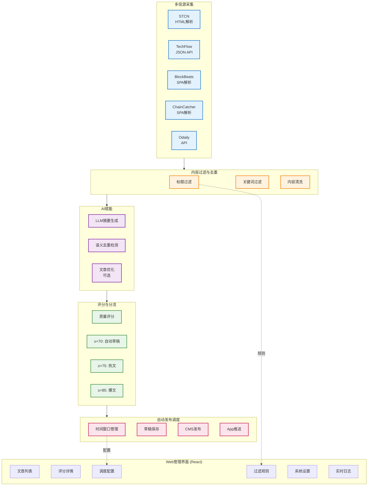

# 《Agent创新、提效提报申请表》

提报部门：___区块链___________

提报日期： ___2026____年____4___月___28____日

申请编号： AGENT-20260428-article-publisher

---

## 第一部分：申请人及Agent信息

1. Agent名称： __article-publisher___
2. 主要开发者（姓名/工号）： _______whisky_____________
3. 协作开发者（如有,并注明开发者分工比例,会作为奖金分配依据）： ____________________
4. 主要开发者/协作开发者TG：18407448471
5. 预期申请等级： □√ S级（全公司通用） □ A级（部门通用） □ B级（小组通用）
6. 人均提效价值预估：_____将资讯采集、筛选、编辑、发布全流程从2小时缩短到10分钟__________
7. 预期Skill等级(L1-L4):_____L2____________
8. 组内成员及提效贡献比例，5-10名（比例作为提效奖金分配依据）：

| 花名 | TG号 | 提效比例 |
|------|------|---------|
|      |      |         |
|      |      |         |
|      |      |         |
|      |      |         |
|      |      |         |

---

## 第二部分：Agent详情说明

### 1. 核心解决的问题或需求（请描述业务痛点）

当前团队在区块链资讯采集、筛选、编辑、发布流程中，普遍存在以下痛点：

- **资讯采集效率低**：依赖人工访问多个信源网站，手动复制粘贴内容到编辑器，重复劳动多。
- **质量控制依赖人工**：标题、内容过滤、去重检测、质量评分全部依赖人工判断，标准不统一。
- **发布流程繁琐**：需要手动上传图片、生成摘要、设置标签，再提交CMS，最后触发App推送。
- **缺乏自动化调度**：无法按时间段自动筛选高质量文章并发布，需要人工值守。
- **无数据沉淀与复盘**：历史发布记录、推送效果、文章评分等数据难以追溯，难以优化策略。

---

### 2. 核心功能与运作逻辑（可附流程图）

**核心功能：**

- **多信源自动化采集**：支持 STCN、TechFlow、BlockBeats、ChainCatcher、Odaily 五大区块链资讯源。
- **智能内容清洗**：基于规则的标题过滤、关键词过滤、内容清洗，自动排除低质量内容。
- **AI赋能流程**：
  - 自动生成文章摘要（基于 GLM-4 等 LLM）
  - 智能评分系统（基础分 + 扣分项，生成评分理由）
  - 语义去重（防止发布重复或相似内容）
  - LLM 文章优化（可选）
- **自动发布调度**：
  - 基于评分的自动发布（≥70分自动保存草稿）
  - 时间窗口调度（早班8-10点、其他时段2小时窗口）
  - App推送标签（≥85分爆文、≥75分热文）
- **Web管理界面**：React 前端 + FastAPI 后端，提供完整的文章管理、调度配置、日志查看功能。

**流程图：**

---

### 3. 主要使用的技术/工具/平台

- **后端框架**：FastAPI + Pydantic + Uvicorn
- **前端框架**：React 19 + Vite 6 + Pure CSS
- **数据库**：SQLite 3（线程本地连接，轻量级部署）
- **认证系统**：JWT 令牌 + 密码哈希（bcrypt）
- **LLM集成**：OpenAI 兼容 API（支持 GLM-4、DeepSeek、通义千问等）
- **页面解析**：BeautifulSoup4 + 自定义 SPA 处理
- **文件上传**：腾讯云 COS（预签名 URL）
- **调度系统**：Python threading.Timer + 自定义窗口调度器
- **日志系统**：Python logging + SSE 实时广播

---

### 4. 预期适用范围（请具体到小组、部门或公司场景）

**建议优先在以下场景试点：**

- **区块链内容团队**：每日资讯自动采集、筛选、发布到内部CMS和App。
- **产品运营小组**：专题文章收集、早报素材准备、竞品跟踪。
- **数据分析小组**：资讯质量评分分析、发布效果追踪、推送效果统计。
- **中台AI应用团队**：作为"AI+资讯工作流"标杆，推广到其他垂直领域。

**适用边界：**

- 适用于公开网页资讯抓取，不承诺绕过付费墙或登录限制。
- 评分规则、过滤策略可自定义，适应不同业务场景。
- 支持多用户协作，支持权限管理。

---

## 第三部分：提交材料清单

请确认以下材料已准备完毕，并将作为附件与本表一同提交：

- [√] 附件一：《Agent设计与验证报告》
- [√] 附件二：《Agent使用与部署文档》
- [√] 附件三：演示方式说明（Web界面地址：`http://your-server:8000`）
- [ ] 其他（请说明）：____________________

---

**开发者承诺：**

本人承诺本申请表及附件内容真实、准确、完整，并同意所提交的Agent进入公司评审与公示流程。

**主要开发者签字：** __________    **日期：** ____2026___年____4___月___28____日

---

**部门GM初审意见：**

□ 材料齐全，同意提交。
□ 建议修改后提交，具体意见：____________________
□ 不予提交，原因：____________________

**部门GM签字：** __________    **日期：** ______年___月___日
